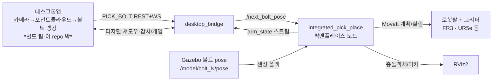

# robotarm_main — 다중 로봇 M8 볼트 빈피킹 (ROS2 Jazzy + Gazebo)

얕은 통(bin)에 놓인 **M8 볼트**를 하나씩 집어 다른 통에 옮기는
빈피킹(bin-picking) 시뮬레이션입니다. **로봇 모델 프로파일** 시스템으로
코드 변경 없이 팔을 갈아끼울 수 있으며, 현재 **Franka FR3**(7축)과
**UR5e + Robotiq 2F-85**(6축)가 등록·검증되어 있습니다.

> **처음 보시는 분께**: 전체 그림은 아래 "파이프라인"과 "디렉토리 구조"만 읽으면
> 잡힙니다. 코드를 고칠 땐 [모듈 지도](#모듈-지도-bin_picking)에서 해당 책임
> 파일 하나만 열면 됩니다.

---

## 파이프라인 (데이터 흐름)



> **로봇은 볼트를 인식하지 않는다.** 인식(카메라→포인트클라우드→랭킹)은
> **데스크톱앱(별도 팀)** 몫이고, 로봇은 좌표를 받아 **집어 옮기고 상태를 실시간
> 보고**하는 실행자다. (예전엔 데스크톱앱 없이 E2E를 테스트하려고 로봇쪽에도
> `bolt_vision` 카메라 노드를 뒀지만, 이제 제거했다.)

1. **좌표 수신**: 데스크톱앱이 1순위 볼트 6D 좌표를 `PICK_BOLT` 로 보내면
   `desktop_bridge` 가 `/next_bolt_pose` 로 재발행한다. (좌표원이 없을 땐 Gazebo
   볼트 pose 를 센싱 폴백으로 씀.)
2. **선택**: 노드가 외부 자세를 우선 쓰고, 없으면 센싱된 볼트 중 자체 선택.
   학습형 선택기(SGD)와 plan-only 롤아웃으로 "실제로 집을 수 있는" 후보를 고름.
3. **집기·놓기**: 볼트 축에 맞춰 그리퍼 각도를 돌려 파지 → 부착 → 리프트 →
   놓는 통 빈 자리에 툭 놓기. 진행 상태(`arm_state`)를 데스크톱에 실시간 발행.

---

## 디렉토리 구조

```
robotarm_main/
├─ README.md                          ← 지금 이 문서
├─ LICENSE / NOTICE                   ← Apache-2.0 + 원저작자 표기
├─ docs/
│  ├─ architecture.md                 ← 모듈 의존 그래프 · 상세 설계
│  ├─ robot_profiles.md               ← 로봇팔 모델 등록 · 검증 · 전환
│  ├─ robot_profiles_audit_plan.md    ← 공유상수 타깃 감사 계획 · 진행 기록
│  ├─ bin_picking_analysis_and_upgrade_plan.md ← 정밀 분석 · 결함 · Claude 실행 백로그
│  ├─ desktop_protocol.md             ← 데스크톱앱 통신 데이터 계약
│  ├─ desktop_protocol_upgrade_plan.md ← 프로토콜 정밀 감사 · v4 Claude 백로그
│  ├─ ros_supervisor_design.md        ← PLC 없는 셀의 ROS 작업관리자 설계 · 구현 백로그
│  └─ desktop_connection_guide.md     ← 데스크톱앱 접속 · 트러블슈팅
├─ tools/                             ← 개발 보조 스크립트 (tilt 수치유도 등)
└─ src/
   ├─ bin_picking/                    ★ 이 프로젝트의 코드 (아래 모듈 지도)
   │  ├─ robot_profiles/data/         프로파일 YAML (fr3 · ur5e_robotiq85)
   │  └─ tools/desktop_sdk/           데스크톱앱 Python 클라이언트 라이브러리
   ├─ franka_description/             FR3 모델(URDF/메시) — 통째 포함(자체 완결)
   ├─ franka_fr3_moveit_config/       MoveIt 설정
   └─ franka_gazebo_bringup/          Gazebo 컨트롤러 설정
```

`src/` 아래를 그대로 colcon 워크스페이스로 빌드하면 됩니다. 외부 저장소를
따로 받을 필요 없이 **이 repo 하나로 실행**됩니다(자체 완결).

---

## 모듈 지도 (`bin_picking/`)

`IntegratedPickPlace` 가 책임별 Mixin 파일을 모두 상속하므로 동작은
완전히 동일하고, 파일만 열어 보면 그 책임의 코드만 보입니다.

| 파일 | 책임 (열면 이것만 보임) |
|---|---|
| `pick_place_node.py` | **여기서 시작.** 전체 흐름(`run`/`_pick`/`_drop`)을 담은 얇은 오케스트레이터 + `main()` |
| `config.py` | 작업 상수(파지 깊이·개구·학습 등)와 "왜 이 값인지" 주석 + 로봇 프로파일 주입 |
| `robot_profiles/` | **로봇 모델 등록/검증/전환** — 스키마(`schema.py`), 레지스트리(`registry.py`), 검증기(`validator.py`), 벤더 YAML 처리(`vendor_yaml.py`) ([`docs/robot_profiles.md`](docs/robot_profiles.md)) |
| `model_cli.py` | `binpick_model` 명령 — 모델 등록·검증·전환 |
| `gripper_adapters.py` | 그리퍼 액션 인터페이스 어댑터(FollowJointTrajectory / GripperCommand) |
| `geometry.py` | 순수 수학: 볼트 축·회전·파지 좌표계·선분거리 (ROS 무의존) |
| `grasp_planning.py` | 그리퍼 개구·접근 기울기·통 벽/도달성 판정 |
| `sensing.py` | 볼트 6D 자세 구독·외부 좌표 입력(`/next_bolt_pose`) (`_all_bolt_poses` 단일 입구) |
| `robot_state.py` | `/joint_states` 구독과 팔·손가락 관절 상태 |
| `moveit_io.py` | MoveIt 계획/실행/Cartesian/IK/FK 래퍼 |
| `gripper.py` | 그리퍼 제어와 파지 성공 판정 |
| `scene.py` | PlanningScene 충돌객체·볼트 attach/detach |
| `markers.py` | RViz 마커 발행 |
| `selection.py` | 볼트 선택(휴리스틱·학습·롤아웃) |
| `bolt_scene.py` | 통/볼트 자산 치수(스폰과 planning-scene 공유 단일 소스) |
| `grasp_selector.py` | 학습형 파지 선택기(sklearn SGD, ROS 무의존) |
| `train_selector.py` | 누적 attempts 로그로 선택기 오프라인 학습 |
| `protocol.py` | 데스크톱 통신 프로토콜 변환/검증 (순수, ROS 무의존) |
| `desktop_bridge.py` | **독립 노드**: 데스크톱앱 통신(REST+WebSocket 하이브리드+토큰인증) |
| `tools_measure_workspace.py` | 도달 범위 격자 측정 도구 (프로파일 workspace 값 유도용) |

의존 방향은 `config ← geometry ← grasp_planning ← (ROS mixin들) ← node` 로
단방향입니다. 자세한 그래프는 [`docs/architecture.md`](docs/architecture.md).

---

## 빌드

```bash
# 사전: ROS2 Jazzy + Gazebo Harmonic + MoveIt2, 그리고
#       pip install scikit-learn numpy   (학습형 선택기용)
#       pip install aiohttp              (데스크톱앱 통신 브릿지용)
cd robotarm_main
source /opt/ros/jazzy/setup.bash   # 쉘이 zsh면 setup.zsh (예: source /opt/ros/jazzy/setup.zsh)
colcon build --symlink-install
source install/setup.bash          # 쉘이 zsh면 install/setup.zsh
```

> **zsh 사용자 주의:** `setup.bash`를 zsh에서 그대로 source하면
> `setup.bash:.:11: 그런 파일이나 디렉터리가 없습니다: .../setup.sh` 에러가 날 수 있습니다
> (`$BASH_SOURCE`로 자기 위치를 찾는데 zsh에는 이게 없어서 `$PWD` 기준으로 잘못 찾음).
> `.bash` 대신 `.zsh` 확장자 버전을 source하면 해결됩니다 — `/opt/ros/jazzy/`와
> `install/` 아래 둘 다 있습니다. 기본 쉘이 뭔지 모르겠으면 `echo $SHELL`로 확인.

## 실행 (터미널 4개)

```bash
ros2 launch bin_picking franka_gazebo_moveit.launch.py   # 1) 로봇 (Gazebo + MoveIt)
ros2 launch bin_picking spawn_bolts.launch.py            # 2) 통 + 볼트 스폰
ros2 run   bin_picking desktop_bridge                    # 3) (선택) 데스크톱앱 통신 브릿지
ros2 run   bin_picking integrated_pick_place --auto      # 4) 데모 (연속 자동)
```

볼트 좌표는 데스크톱앱이 `PICK_BOLT` 로 보내면 `desktop_bridge` 가
`/next_bolt_pose` 로 넘겨줍니다. 데스크톱앱 없이 도는 데모(위 4개)에서는 노드가
Gazebo 볼트 pose 를 센싱 폴백으로 써서 스스로 대상을 고릅니다.

`--auto` 를 빼면 사이클마다 수동 진행:
`ros2 topic pub --once /next_step std_msgs/msg/Empty '{}'`

**RViz**: Fixed Frame은 활성 모델에 따라 다릅니다(FR3: `fr3_link0`,
UR5e: `base_link`). MarkerArray(`/pick_place_markers`).

---

## 데스크톱앱 통신 (검증용)

데스크톱앱은 별도 팀이 만들 예정입니다. 로봇쪽 통신 종단점(`desktop_bridge`
노드, REST+WebSocket 하이브리드+토큰인증)만 먼저 준비해 뒀습니다 — 데이터 계약과
설계 근거는 [`docs/desktop_protocol.md`](docs/desktop_protocol.md), **접속 방법·검증
절차·트러블슈팅**은 [`docs/desktop_connection_guide.md`](docs/desktop_connection_guide.md)
참고. 실물 운용 수준으로 올리기 위한 확인 결함과 v4 구현 순서는
[`docs/desktop_protocol_upgrade_plan.md`](docs/desktop_protocol_upgrade_plan.md)에 있습니다.
PLC 없이 셀 상태기계·명령 승인·취소·복구를 담당할 ROS 작업관리자 설계는
[`docs/ros_supervisor_design.md`](docs/ros_supervisor_design.md)를 참고하세요.

**범위:** 볼트 인식(카메라→포인트클라우드→랭킹)은 데스크톱 앱(다른 팀)이 담당하는
별개 파이프라인이라 로봇 쪽에는 없습니다. 로봇은 데스크톱이 보낸 좌표(`PICK_BOLT`
→ `/next_bolt_pose`)를 받아 집을 뿐이며, 여기서 검증하는 건 **로봇팔 ↔ 데스크톱
통신**입니다.

### 명령 한 줄로 전체 기동 (권장)
```bash
pip install --user --break-system-packages aiohttp   # 최초 1회
ros2 launch bin_picking desktop_integration_demo.launch.py
```
Gazebo+MoveIt → 볼트 스폰 → `desktop_bridge` → `integrated_pick_place` 를
순서대로(지연 기동으로) 한 번에 띄운다. 옵션: `rviz:=true`(뷰어 표시),
`auto:=false`(수동 진행), `bolts_delay:=25.0`/`apps_delay:=30.0`(느린 컴퓨터라
기본 지연시간으로 부족하면 늘리기).

### 통신 프로토콜만 (Gazebo 없이, 가장 가벼움)
```bash
ros2 run bin_picking desktop_bridge --ros-args -p api_token:=<토큰>   # Gazebo 없이도 켜짐(토큰 안 주면 로그에 임의생성값 출력)
python3 src/bin_picking/tools/mock_desktop_client.py --token <토큰>   # 데스크톱 대역 목 클라이언트(ROS 무의존)
```

### Python 클라이언트 라이브러리 (`desktop_sdk`)

데스크톱앱 팀이 Python으로 연동할 때 쓸 수 있는 클라이언트 라이브러리가
`src/bin_picking/tools/desktop_sdk/`에 있습니다. REST/WebSocket 양쪽을 감싸고,
토큰 인증·자동 재연결·타입 모델(`models.py`)을 제공합니다.

실전 사용법(오류 대처·주의사항 등)은 Notion "실전 사용 가이드" 문서 참고.

---

## 로봇팔 모델 바꾸기

관절 이름·관절 한계·그리퍼 지령 단위·손끝 기하·도달성 한계·MoveIt 설정 위치처럼
**로봇마다 달라지는 값**은 코드가 아니라 등록된 **프로파일**(YAML)에 있습니다.
한 번 등록해 검증까지 마치면 명령 하나로 전환됩니다.

```bash
ros2 run bin_picking binpick_model list            # 등록된 모델과 검증 상태
ros2 run bin_picking binpick_model new my_arm      # 새 모델 등록 뼈대 생성
ros2 run bin_picking binpick_model verify my_arm   # URDF/실행 중 시스템과 대조
ros2 run bin_picking binpick_model use my_arm      # 활성 모델 전환(다음 기동부터)

# 일회성으로 다른 모델 띄우기
ros2 launch bin_picking desktop_integration_demo.launch.py robot_model:=my_arm
```

검증되지 않은 모델로는 전환이 **거부**됩니다 — 관절 한계나 그리퍼 지령 단위가
틀린 채로 움직이면 실물에서 충돌·과주행로 직결되기 때문입니다.

등록 절차와 각 항목을 어디서 얻는지는 [`docs/robot_profiles.md`](docs/robot_profiles.md).
데스크톱앱에서 전환하는 REST 엔드포인트도 같은 문서에 있습니다.

### 등록된 모델

| 모델 | 팔 | 그리퍼 | 상태 |
|---|---|---|---|
| `fr3` | Franka FR3 (7축) | Franka Hand (linear) | verified, task_validated |
| `ur5e_robotiq85` | UR5e (6축) | Robotiq 2F-85 (angular) | verified |

다른 제조사 팔을 추가하려면 그 팔의 description/MoveIt 패키지(+ 그리퍼)를
확보한 뒤 `binpick_model new`로 프로파일을 만들면 됩니다.

---

## 혼합 박스 팔레타이징 (별도 데모)

사용자 지정 「실시간 바코드 기반 온라인 혼합 박스 팔레타이징 시스템」 PDF의
오프라인 배치와 **진공 흡착 툴을 장착한 FR3의 실제 운반 데모**를 구현했습니다.
빌드 후 `ros2 launch bin_picking palletizing_demo.launch.py`를 실행하면
컨베이어 픽업 지점의 박스 **36개를 3단**으로 쌓습니다. 기본 `strategy:=dense`는
박스별 0°/90° 회전·3 mm 간격·다중 상면 지지·누적 하중을 검사하며,
128개 후보 배치를 비교합니다. 계산에 약 1분, 실제 운반에는 추가 시간이 필요합니다.
이전 6개 데모는 `strategy:=compact box_count:=6`로 실행할 수 있습니다.
바코드·목적지·버퍼 회수는 후속 단계입니다. 정적 미리보기는 `mode:=preview`.
범위·실행법·검증 기록은 [`docs/palletizing_implementation.md`](docs/palletizing_implementation.md).

## 학습 데이터

파지 성공/실패 이력은 홈의 `~/pick_place_logs/attempts.jsonl` 에 누적되며,
`selector_model.pkl` 로 온라인 학습됩니다. 이 파일들은 **repo에 포함되지
않습니다**(`.gitignore`) — 실행 머신에 남는 런타임 상태입니다.

## 출처 / 라이선스

이 프로젝트는 [PinkWink/robotarm_tutorials](https://github.com/PinkWink/robotarm_tutorials)
를 기반으로 빈피킹 데모를 추가·재구성한 것입니다. `franka_description` 등
Franka 자산과 함께 **Apache-2.0** 을 따릅니다. 자세한 표기는
[`NOTICE`](NOTICE) 참조.
