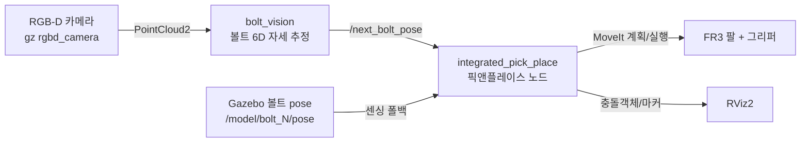

# robotarm_main — FR3 M8 볼트 빈피킹 (ROS2 Jazzy + Gazebo)

Franka **FR3** 7축 로봇과 평행 그리퍼로, 얕은 통(bin)에 놓인 **M8 볼트**를
하나씩 집어 다른 통에 옮기는 빈피킹(bin-picking) 시뮬레이션입니다.

> **처음 보시는 분께**: 전체 그림은 아래 "파이프라인"과 "디렉토리 구조"만 읽으면
> 잡힙니다. 코드를 고칠 땐 [모듈 지도](#모듈-지도-bin_picking)에서 해당 책임
> 파일 하나만 열면 됩니다 — 3350줄 단일 파일을 책임별로 나눠 두었습니다.

---

## 파이프라인 (데이터 흐름)



1. **인식** (`bolt_vision`): 통 위 카메라의 포인트클라우드를 base 프레임으로 변환 →
   통 영역만 잘라 클러스터링(DBSCAN) → 볼트별 중심·축(PCA) 추정 →
   가장 집기 좋은 볼트의 6D 자세를 `/next_bolt_pose` 로 발행.
2. **선택**: 노드가 외부 자세를 우선 쓰고, 없으면 센싱된 볼트 중 자체 선택.
   학습형 선택기(SGD)와 plan-only 롤아웃으로 "실제로 집을 수 있는" 후보를 고름.
3. **집기·놓기**: 볼트 축에 맞춰 그리퍼 각도를 돌려 파지 → 부착 → 리프트 →
   놓는 통 빈 자리에 툭 놓기.

---

## 디렉토리 구조

```
robotarm_main/
├─ README.md              ← 지금 이 문서
├─ LICENSE / NOTICE       ← Apache-2.0 + 원저작자 표기
├─ docs/architecture.md   ← 모듈 의존 그래프 · 상세 설계
├─ docs/robot_profiles.md ← 로봇팔 모델 등록 · 검증 · 전환 (다른 제조사 팔 붙이기)
└─ src/
   ├─ bin_picking/                 ★ 이 프로젝트의 코드 (아래 모듈 지도)
   ├─ franka_description/          FR3 모델(URDF/메시) — 통째 포함(자체 완결)
   ├─ franka_fr3_moveit_config/    MoveIt 설정
   └─ franka_gazebo_bringup/       Gazebo 컨트롤러 설정
```

`src/` 아래를 그대로 colcon 워크스페이스로 빌드하면 됩니다. 외부 저장소를
따로 받을 필요 없이 **이 repo 하나로 실행**됩니다(자체 완결).

---

## 모듈 지도 (`bin_picking/`)

원래 한 파일(3350줄)이던 갓클래스를 **책임별 Mixin 파일**로 나눴습니다.
`IntegratedPickPlace` 가 이들을 모두 상속하므로 동작은 완전히 동일하고,
파일만 열어 보면 그 책임의 코드만 보입니다.

| 파일 | 책임 (열면 이것만 보임) |
|---|---|
| `pick_place_node.py` | **여기서 시작.** 전체 흐름(`run`/`_pick`/`_drop`)을 담은 얇은 오케스트레이터 + `main()` |
| `config.py` | 작업 상수(파지 깊이·개구·학습 등)와 "왜 이 값인지" 주석 + 로봇 프로파일 주입 |
| `robot_profiles/` | **로봇 모델 등록/검증/전환** — 업체마다 다른 값(관절·그리퍼·도달성·설정 위치)을 데이터로 분리 ([`docs/robot_profiles.md`](docs/robot_profiles.md)) |
| `model_cli.py` | `binpick_model` 명령 — 모델 등록·검증·전환 |
| `gripper_adapters.py` | 그리퍼 액션 인터페이스 어댑터(FollowJointTrajectory / GripperCommand) |
| `geometry.py` | 순수 수학: 볼트 축·회전·파지 좌표계·선분거리 (ROS 무의존) |
| `grasp_planning.py` | 그리퍼 개구·접근 기울기·통 벽/도달성 판정 |
| `sensing.py` | 볼트 6D 자세 구독·외부 비전 입력 (`_all_bolt_poses` 단일 입구) |
| `robot_state.py` | `/joint_states` 구독과 팔·손가락 관절 상태 |
| `moveit_io.py` | MoveIt 계획/실행/Cartesian/IK/FK 래퍼 |
| `gripper.py` | 그리퍼 제어와 파지 성공 판정 |
| `scene.py` | PlanningScene 충돌객체·볼트 attach/detach |
| `markers.py` | RViz 마커 발행 |
| `selection.py` | 볼트 선택(휴리스틱·학습·롤아웃) |
| `bolt_vision.py` | **독립 노드**: 카메라 포인트클라우드 → 볼트 6D 자세 |
| `bolt_scene.py` | 통/볼트 자산 치수(스폰과 planning-scene 공유 단일 소스) |
| `grasp_selector.py` | 학습형 파지 선택기(sklearn SGD, ROS 무의존) |
| `train_selector.py` | 누적 attempts 로그로 선택기 오프라인 학습 |
| `desktop_bridge.py` | **독립 노드**: 데스크톱앱 통신(REST+WebSocket 하이브리드+토큰인증, `docs/desktop_protocol.md` §4) |

의존 방향은 `config ← geometry ← grasp_planning ← (ROS mixin들) ← node` 로
단방향입니다. 자세한 그래프는 [`docs/architecture.md`](docs/architecture.md).

---

## 빌드

```bash
# 사전: ROS2 Jazzy + Gazebo Harmonic + MoveIt2, 그리고
#       pip install scikit-learn numpy   (학습형 선택기용)
#       pip install aiohttp              (데스크톱앱 통신 브릿지용)
cd robotarm_main
source /opt/ros/jazzy/setup.bash   # 쉘이 zsh면 setup.zsh (예: source /opt/ros/jazzy/setup.zsh)
colcon build --symlink-install
source install/setup.bash          # 쉘이 zsh면 install/setup.zsh
```

> **zsh 사용자 주의:** `setup.bash`를 zsh에서 그대로 source하면
> `setup.bash:.:11: 그런 파일이나 디렉터리가 없습니다: .../setup.sh` 에러가 날 수 있습니다
> (`$BASH_SOURCE`로 자기 위치를 찾는데 zsh에는 이게 없어서 `$PWD` 기준으로 잘못 찾음).
> `.bash` 대신 `.zsh` 확장자 버전을 source하면 해결됩니다 — `/opt/ros/jazzy/`와
> `install/` 아래 둘 다 있습니다. 기본 쉘이 뭔지 모르겠으면 `echo $SHELL`로 확인.

## 실행 (터미널 6개, 비전 포함 전체 파이프라인)

```bash
ros2 launch bin_picking franka_gazebo_moveit.launch.py   # 1) 로봇 + 카메라
ros2 launch bin_picking spawn_bolts.launch.py            # 2) 통 + 볼트 스폰
ros2 launch bin_picking vision_pipeline.launch.py        # 3) (선택) 카메라 브릿지
ros2 run   bin_picking bolt_vision                       # 4) (선택) 비전 인식
ros2 run   bin_picking integrated_pick_place --auto      # 5) 데모 (연속 자동)
ros2 run   bin_picking desktop_bridge                    # 6) (선택) 데스크톱앱 통신 브릿지
```

`--auto` 를 빼면 사이클마다 수동 진행:
`ros2 topic pub --once /next_step std_msgs/msg/Empty '{}'`

**RViz**: Fixed Frame `fr3_link0`, PointCloud2(`/bin_camera/points`,
Reliability=**Best Effort**), MarkerArray(`/pick_place_markers`).

---

## 데스크톱앱 통신 (검증용)

데스크톱앱은 별도 팀이 만들 예정입니다. 로봇쪽 통신 종단점(`desktop_bridge`
노드, REST+WebSocket 하이브리드+토큰인증)만 먼저 준비해 뒀습니다 — 데이터 계약과
설계 근거는 [`docs/desktop_protocol.md`](docs/desktop_protocol.md), **접속 방법·검증
절차·트러블슈팅**은 [`docs/desktop_connection_guide.md`](docs/desktop_connection_guide.md)
참고.

**범위:** 비전(카메라→포인트클라우드→볼트 인식)은 데스크톱 앱과 직접 통신하는
별개 파이프라인입니다(다른 팀 담당). 여기서 검증하는 건 **로봇팔 ↔ 데스크톱
통신**뿐이라, 아래 명령엔 비전 노드(`vision_pipeline`/`bolt_vision`)가 없습니다.

### 명령 한 줄로 전체 기동 (권장)
```bash
pip install --user --break-system-packages aiohttp   # 최초 1회
ros2 launch bin_picking desktop_integration_demo.launch.py
```
Gazebo+MoveIt → 볼트 스폰 → `desktop_bridge` → `integrated_pick_place` 를
순서대로(지연 기동으로) 한 번에 띄운다. 옵션: `rviz:=true`(뷰어 표시),
`auto:=false`(수동 진행), `bolts_delay:=25.0`/`apps_delay:=30.0`(느린 컴퓨터라
기본 지연시간으로 부족하면 늘리기).

### 통신 프로토콜만 (Gazebo 없이, 가장 가벼움)
```bash
ros2 run bin_picking desktop_bridge --ros-args -p api_token:=<토큰>   # Gazebo 없이도 켜짐(토큰 안 주면 로그에 임의생성값 출력)
python3 src/bin_picking/tools/mock_desktop_client.py --token <토큰>   # 데스크톱 대역 목 클라이언트(ROS 무의존)
```

실전 사용법(오류 대처·주의사항 등)은 Notion "실전 사용 가이드" 문서 참고.

---

## 로봇팔 모델 바꾸기

관절 이름·관절 한계·그리퍼 지령 단위·손끝 기하·도달성 한계·MoveIt 설정 위치처럼
**로봇마다 달라지는 값**은 코드가 아니라 등록된 **프로파일**(YAML)에 있습니다.
한 번 등록해 검증까지 마치면 명령 하나로 전환됩니다.

```bash
ros2 run bin_picking binpick_model list            # 등록된 모델과 검증 상태
ros2 run bin_picking binpick_model new my_arm      # 새 모델 등록 뼈대 생성
ros2 run bin_picking binpick_model verify my_arm   # URDF/실행 중 시스템과 대조
ros2 run bin_picking binpick_model use my_arm      # 활성 모델 전환(다음 기동부터)

# 일회성으로 다른 모델 띄우기
ros2 launch bin_picking desktop_integration_demo.launch.py robot_model:=my_arm
```

검증되지 않은 모델로는 전환이 **거부**됩니다 — 관절 한계나 그리퍼 지령 단위가
틀린 채로 움직이면 실물에서 충돌·과주행로 직결되기 때문입니다.

등록 절차와 각 항목을 어디서 얻는지는 [`docs/robot_profiles.md`](docs/robot_profiles.md).
데스크톱앱에서 전환하는 REST 엔드포인트도 같은 문서에 있습니다.

> 현재 벤더링된 자산은 **FR3 하나**입니다. 다른 제조사 팔을 실제로 띄우려면
> 그 팔의 description/MoveIt 패키지(+ 그리퍼)를 먼저 확보해야 합니다.

---

## 학습 데이터

파지 성공/실패 이력은 홈의 `~/pick_place_logs/attempts.jsonl` 에 누적되며,
`selector_model.pkl` 로 온라인 학습됩니다. 이 파일들은 **repo에 포함되지
않습니다**(`.gitignore`) — 실행 머신에 남는 런타임 상태입니다.

## 출처 / 라이선스

이 프로젝트는 [PinkWink/robotarm_tutorials](https://github.com/PinkWink/robotarm_tutorials)
를 기반으로 빈피킹 데모를 추가·재구성한 것입니다. `franka_description` 등
Franka 자산과 함께 **Apache-2.0** 을 따릅니다. 자세한 표기는
[`NOTICE`](NOTICE) 참조.
