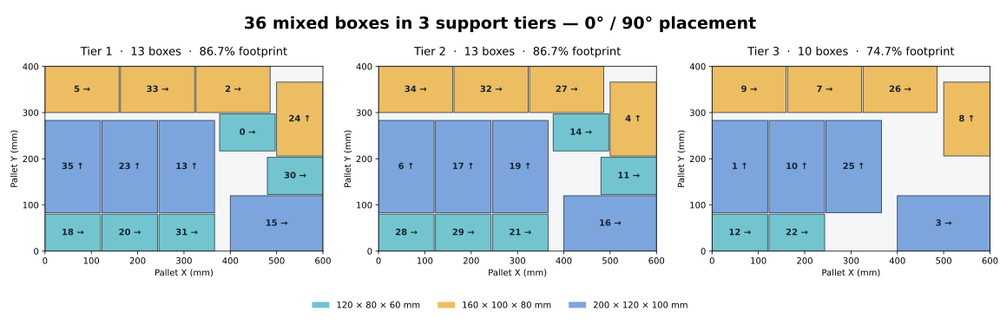

# 바코드 기반 온라인 혼합 박스 팔레타이징 — 구현 기록

기준일: 2026-09-09. 사용자 지정 PDF **「실시간 바코드 기반 온라인 혼합 박스
팔레타이징 시스템」(7쪽)**을 요구사항 원본으로 한다.
원본 파일: `/mnt/c/Users/yg1/Downloads/556549eb-0e9f-424f-b612-67019fce6387_실시간_바코드_기반_온라인_혼합_박스_팔레타이징_시스템.pdf`.

`ros_palletizing_sim_requirements_2026-09-09.md`의 특허 실험 M1~M4보다
**PDF §12의 6단계 개발 순서를 우선**한다. 가상 회수 실험의 T0/T3는 별도 실험으로
보존하며, 이 시스템의 구현 완료나 성능 근거로 대신 사용하지 않는다.

## 개발 순서

사용자 후속 요청(“로봇이 움직여야 하고 그리퍼도 바꿔야 한다”)에 따라,
바코드 연동보다 **흡착 툴과 실제 운반 실행**을 먼저 구현했다.

| 단계 | PDF 범위 | 구현 상태 |
|---|---|---|
| 1 | 박스 3종, 팔레트 1개, 오프라인 배치 | 구현, 검증 기록은 아래 참고 |
| 2 | 바코드 기반 목적지·순서 관리 | 미구현 |
| 3 | 랜덤 유입, 출고/임시 팔레트 분기 | 미구현 |
| 4 | 버퍼 회수·재적재 | 미구현 |
| 5 | 로봇 IK·충돌검사·실행 피드백 | FR3 진공 툴·MoveIt 실제 운반·Gazebo 위치 검증 구현, 실물/비전 피드백 미구현 |
| 6 | 알고리즘 비교·성능 대시보드 | 미구현 |

## 현재 기본 데모 — 실제 흡착·운반

```zsh
source /opt/ros/jazzy/setup.zsh
source install/setup.zsh
ros2 launch bin_picking palletizing_demo.launch.py
```

### 3단 밀집 배치 (2026-09-09 후속 요청)

기본값은 **`strategy:=dense box_count:=36`**이다. 기존 박스 3종을 그대로 사용한다.
높이가 다른 혼합 박스이므로 여기서 3단은 **지지 관계의 깊이 최대 3**을 뜻한다.
모든 박스 상면이 같은 세 개의 수평면이 되는 것은 아니다.

- 0°/90° 회전과 양쪽 모서리 정렬 후보를 비교하여 좁은 잔여 공간을 채운다.
  입력 우선순위·배치 점수·재현 가능한 순열을 조합한 **128개 후보**를 비교한다.
  누락 수 → 수용 부피 → 높이 → 질량 높이 모멘트 순으로 선택하며, 전역 최적 보장은 없다.
- 실행 간격은 **3 mm**. 미리 부풀린 가상 박스가 아니라 **실제 상면 치수**로 지지를 검사한다.
  동일 높이의 여러 박스가 함께 받치는 경우 접촉 면적 합계가 바닥의 90% 이상이고,
  네 모서리에서 6 mm 안쪽인 점이 모두 지지면 위에 있어야 한다.
- 지지 면적 비율에 따라 하중을 분배하고 모든 하부 박스로 누적 전파하여 허용하중을 검사한다.
  이 모델은 강체의 정적 근사다. 박스 압궤·마찰 기반 동적 안정성의 증명은 아니다.
- 하부를 먼저 실행하고, 팔레트 먼 쪽부터 채운다. 각 배치의 전체 수직 하강을 미리 검사한다.
  필요하면 직사각형의 최종 축 방향이 같은 180° 손목 대안을 선택한다.
  일부 경로가 실패하면 전체 충돌 검사를 끄지 않고 다른 IK/접근 높이를 검토한다.
- 픽업 하강에도 같은 사전 검사를 적용한다. 낮은 접근점을 선택했다면 짧게 수직으로
  들어 올린 후 충돌 검사된 관절 경로로 운반 높이에 진입한다.
- 접근 자세로 실제 이동한 뒤 실측 관절값에서 하강을 다시 계산하며,
  99.9% 이상인 그 궤적을 그대로 실행한다. 실행 종점은 TCP 2 mm 이내를 확인한다.
- 상단 배치 때 해당 하부 지지물과의 접촉만 허용한다. 운반 높이는 기존 적재 상면을 반영한다.
  배치 후 위치 5 mm·방향 2° 이내와 수직 자세를 확인하고 기존 박스의 충돌체도 재동기화한다.

기본 seed=20260909의 기하 결과: **36/36, 거부 0, 3단, 90° 회전 12개, 높이 300 mm**.
300 mm 적재 외곽 기준 부피 활용률 **70.93%**(설정된 500 mm 전체 용량 기준 42.56%).
128개 탐색은 이 환경에서 약 61초였다. 실제 운반 완료 여부는 별도 실행 검증으로 기록한다.
같은 seed·같은 36개 입력의 이전 `compact` 실행 배치는 **4단·400 mm·53.20%**였다.
새 배치는 같은 물량의 적재 높이를 **25% 낮췄다**. 이는 기하 비교이며 사이클타임 비교가 아니다.
90° 개수는 팔레트 계획 좌표 기준이다(실행 world 좌표에서는 팔레트 축을 교환한다).



단별 개수는 **13 / 13 / 10**, 각 단의 투영 면적 점유율은 **86.7% / 86.7% / 74.7%**다.
위 그림은 실행 노드가 발행한 계획으로 만든 배치도이며 실행 완료 증거와 구분한다.
원본은 `palletizing_dense_plan_2026-09-09.json`.
재비교 명령은 패키지 루트에서 `python3 -m tools.benchmark_palletizing_dense`.
물량을 임의로 늘려 3단에 전량 배치할 수 없는 경우, 거부 목록을 보고하고 실행을 시작하지 않는다.

#### 동일 시뮬레이션에서 명시적으로 이어서 실행

`FAULT` 후 기존 실행자만 종료하고 Gazebo·MoveIt·브리지는 유지한 경우에 한한다.
시드·개수·전략이 같고, 로봇이 정지했으며, MoveIt에 부착 물품이 없어야 한다.
실측 위치·방향·치수로 완료된 연속 구간과 픽업 지점의 현재 박스를 대조한다.
지지면 위에서 확인한 물품만 해제 명령으로 상태를 정리한다. 이벤트성 상태 토픽에
과거 `detached` 메시지가 없다는 이유로 센서값을 만들어 채우지 않는다.
공중 물품·위치 불일치·완료 순서의 빈 구간·중복 실행자는 재개를 거부한다.

```zsh
ros2 run bin_picking palletizing_motion --ros-args -p use_sim_time:=true -p resume:=true
```

흡착 중 중단된 경우에는 별도로 `-p resume_held:=true`를 지정한다. 부착 물품이 정확히
하나이고 다음 미완료 작업의 ID·툴 링크와 일치하며, 실제 박스 상면과 TCP 접촉 조건이
유지되는지 반복 확인한 경우에만 그 물품의 운반/배치부터 재개한다. 확인한 흡착 물품에는
초기 해제나 재스폰을 하지 않는다.

일반 실행은 자동 재개하지 않는다. 이 기능은 같은 Gazebo 작업셀의 진단용 재개이며,
실물 로봇의 안전 복구나 Supervisor의 영속 작업 기록을 대체하지 않는다.

```zsh
# 새 기본 3단 실행
ros2 launch bin_picking palletizing_demo.launch.py
# 이전에 검증한 6개 실행
ros2 launch bin_picking palletizing_demo.launch.py strategy:=compact box_count:=6
```

### 공통 실행 구조

- **평행 그리퍼 제거:** `hand=false` FR3에 알루미늄 플랜지·진공 매니폴드·4개
  벨로즈 흡착컵을 추가한다. `vacuum_tcp`까지 SRDF 체인을 확장하고 팔 컨트롤러만
  사용한다. 원본 Franka 자산과 기본 빈피킹 로봇 프로파일은 수정하지 않는다.
- **작업셀:** 롤러 컨베이어 픽업 지점, 600×400 mm 목재 팔레트(600 mm 변은 world Y),
  포장 테이프·바코드 라벨 박스, 바닥 구획선, 전용 Gazebo/RViz 화면.
- **실제 실행:** 준비 → 픽업 지점 박스 생성 → 접근 → 수직 하강 → 흡착 → 상승 →
  운반 → 수직 배치 → 흡착 해제 → 후퇴 → 위치 확인. 기본 3종 × 12개 = **36개**.
  MoveIt 계획을 `ExecuteTrajectory` 액션으로 팔 컨트롤러에 실행한다.
- **물리 부착:** Gazebo `DetachableJoint`로 박스를 툴에 연결한다.
  운반 중 박스 pose를 직접 갱신하지 않는다. 해제 후에는 중력과 접촉으로 안착한다.
  최초 스폰 시 플러그인의 기본 attached 상태를 해제한 뒤 접근을 시작한다.
- **이전 compact 실행 여유:** 기하 기준선과 달리 박스 사이 **12 mm** 여유를 예약한다.
  빈틈 없는 배치가 두 번째 박스의 하강 경로를 막았던 실제 실행 실패를 반영했다.
- **확인:** 흡착 전 TCP–상면 간격·4컵 footprint·접근 방향, 상승 후 실제 박스 높이,
  배치 후 위치 오차(5 mm 이내)·방향·상향 자세를 검사한다. Cartesian 경로는 99.9% 이상만
  실행한다. 완료 수는 배치 확인을 통과한 뒤 증가한다.
- **중단:** `/palletizing/stop` (`std_msgs/Empty`) 요청 시 활성 궤적의 cancel을 요청한다.
  실패하면 `FAULT`를 유지하며 부착 물품을 자동 해제하지 않는다.
  `/palletizing/status` (`std_msgs/String` JSON)에 phase·완료 수·흡착 상태를 발행한다.

기본 인자: `mode:=motion`, `box_count:=36`, `strategy:=dense`, `velocity:=0.35`,
`rviz:=true`. `velocity`는 (0, 0.6]의 MoveIt 스케일이다.
이전 순수 기하 미리보기는 `mode:=preview strategy:=compact box_count:=12`로 실행한다.
완료된 배치를 유지하므로 새 배치를 실행하려면 데모를 종료하고 다시 실행한다.

**범위:** 물리엔진에서의 이상적인 흡착 조인트이며 진공 압력·누설·컵 변형을 계산하지
않는다. 컨베이어는 롤러 형상의 픽업 설비이고, 박스 공급은 픽업 지점에서의 순차 생성으로
모사한다. 바코드 무늬는 표시용이며 아직 스캐너·주문 시스템과 연결되지 않았다.
현재 배치 순서는 오프라인 계획 순서다. 온라인 도착/목적지/버퍼 회수까지 완료한 것은 아니다.

### 이전 compact 실행 검증 (2026-09-09, 6개)

- Headless: 박스 3종 **3/3** 흡착·운반·해제·배치 확인 완료.
- Gazebo GUI + RViz: 기본 **6/6** 운반 완료, 로그에 `PLACED` 6회 및 `COMPLETE` 확인.
- 신규 URDF/SRDF: 평행 손가락 링크 없음, `vacuum_tcp` IK 체인 및 박스 6개용 물리 조인트 확인.
- Python 회귀 **240 passed**, colcon **5 packages finished**.
- 읽기 전용 최종 검사:

```zsh
python3 src/bin_picking/tools/check_palletizing_scene.py --mode motion --strategy compact --box-count 6
```

`COMPLETE`를 기다린 뒤 Gazebo 위치·MoveIt 충돌체·잔여 부착 객체를 대조한다.
실측 결과: 객체 8개(설비 2 + 박스 6), 실제 박스 pose 6개, 잔여 부착 없음,
계획 대비 최대 위치 오차 **0.001 mm 미만**, MoveIt 동기화 오차 **0 mm**, 오류 목록 없음.
이는 이상적인 시뮬레이션 결과이며 실물 로봇의 정밀도 수치가 아니다.

## 1단계 기하 기준선 구현 (preview 모드)

- PDF §10의 **600×400 mm** 출고 팔레트 1개. 적재 높이 제한은 데모 입력 500 mm.
- 박스 3종: 120×80×60 mm/0.4 kg, 160×100×80 mm/0.7 kg,
  200×120×100 mm/1.0 kg. 크기·중량·허용 상부하중(5 kg)은 **모사 입력값**이다.
- 기본 12개, seed=20260909. 입력 전체를 알고 계산하는 오프라인 계획이다.
  `greedy`는 입력 순서대로 배치하는 기준선, 기본 `compact`는 원래 순서·바닥면적·
  부피·중량·낮은 높이 우선 순서를 비교한다(같은 순서는 중복 계산하지 않음).
  누락 수 → 누락 부피 → 적재 높이 → 질량의 높이 모멘트 순으로 결과를 고른다.
  Greedy 결과를 항상 후보에 포함하여 이 품질 순서에서는 기준선보다 나빠지지 않는다.
  출고 순서 제약이 생기는 온라인 단계에 이 재정렬 정책을 그대로 적용하면 안 된다.
- 회전 0°/90° 후보 중 경계·겹침·지지·누적 하중을 검사하여 가장 낮은 배치를 우선한다.
  공중 배치와 오버행은 거부한다. 1단계 지지는 단일 하부 박스의 **100% 상면 지지**만
  허용하며, 여러 박스에 걸친 지지·변형·마찰·가속 시 전도는 모델링하지 않는다.
- 배치 불가 물품은 `rejected`로 보고한다. 전체 적재 성공으로 간주하거나 숨기지 않는다.
- 배치 → 공통 장면 데이터 → SDF/MoveIt 직육면체로 변환한다. SDF는 별도 고정 파일을
  복사하지 않고 실행 시 생성하여 치수와 좌표의 중복 정의를 피한다.
- Gazebo pose 수신 뒤 `/apply_planning_scene` 서비스로 실제 자세를 반영한다.
  모든 박스 pose와 서비스 성공이 확인돼야 `STAGE1_READY`를 출력한다.
- `/packing/plan`은 `std_msgs/String` JSON(계획·배치 실패·활용률),
  `/palletizing/labels`는 RViz용 `MarkerArray`다. 아직 최종 온라인 메시지 계약은 아니다.

아래 기하 기준선 자체는 **각 파지점의 FR3 IK 도달성을 보장하지 않는다**.
`preview`는 계산된 최종 배치를 스폰하여 보여 준다. 로봇이 박스를 운반한 결과가 아니며,
로봇 적재 성공률·순서 준수율·사이클타임을 측정한 것으로 해석하면 안 된다.

## 실행

ROS 없이 계획 JSON만 생성:

```bash
cd src/bin_picking
python3 -m bin_picking.palletizing_planner --seed 20260909 --box-count 12
python3 -m tools.benchmark_palletizing --cases 30 --counts 12 24 36
```

저장소 루트에서 빌드 후 실행(zsh):

```zsh
source /opt/ros/jazzy/setup.zsh
colcon build --symlink-install
source install/setup.zsh
ros2 launch bin_picking palletizing_demo.launch.py mode:=preview box_count:=12
```

기존 Gazebo와 MoveIt이 이미 켜져 있으면 장면만 추가한다(새 world에서 1회 실행):

```zsh
ros2 launch bin_picking spawn_palletizing.launch.py robot_model:=fr3
```

주요 인자: `strategy:=compact`(또는 `greedy`), `box_count:=12`(1~60), `seed:=20260909`, `rviz:=true`,
`scene_delay:=15.0`, `robot_model:=fr3`. 기본 Gazebo GUI 렌더러는 `ogre`.
RViz의 PlanningScene으로 충돌체를 보고, MarkerArray `/palletizing/labels`를 추가하면
박스 ID도 볼 수 있다. 데모는 팔레트 상면이 z=0.04 m, 중심이 (0.5, 0, 0.02) m다.

## 검증 기록

- `python3 -m pytest test/ -q`: **235 passed**(팔레타이징 30개 포함).
- `colcon build --symlink-install`: **5 packages finished**.
- 기본 compact 배치: 12/12 배치, 거부 0, 사용 높이 0.10 m,
  설정 용량 대비 체적 활용률 14.19%, 실제 사용 높이 기준 70.93%.
  같은 입력의 greedy는 0.16 m, 44.33%다. 고정 팔레트 용량 대비 활용률은 같으며,
  **적재 높이 감소**로 실제 사용 높이 기준의 밀도가 개선된 것이다.
- **Headless Gazebo/MoveIt 실기동 통과:** compact 장면 박스 pose 12개와
  충돌체 13개 대조, 계획 위치 오차 최대 0.000580 mm, MoveIt 동기화 오차 0 mm,
  오류 0. 이는 시뮬레이션 수치이며 실물 센서 정밀도가 아니다.
  GUI 화면과 로봇 운반은 이 검증에 포함하지 않았다.
- 첫 장면 검증에서 SDF pose를 스포너 기본값이 덮어쓰는 오류를 발견해
  `-x/-y/-z` 명시로 수정했다. 검증은 별도 ROS_DOMAIN_ID=79 및
  GZ_PARTITION=palletizing_pdf_stage1에서 실행했고, 종료 후 해당 시뮬레이션을 정리했다.

실행 중인 장면의 Gazebo pose와 MoveIt 충돌체를 대조하는 읽기 전용 검사:

```zsh
python3 src/bin_picking/tools/check_palletizing_scene.py --mode preview --box-count 12
```

## 알고리즘 비교 (2026-09-09)

같은 3종 박스의 입력 순서만 seed=20260909~20260938로 바꾼 30개 사례씩,
총 90개를 실행했다. 원시 집계: [`palletizing_benchmark_2026-09-09.json`](palletizing_benchmark_2026-09-09.json).

| 박스 수 | 평균 높이 Greedy → Compact | 평균 미배치 수 | 평균 계획 시간 |
|---|---|---|---|
| 12 | 136 → 100 mm | 0 → 0 | 10.4 → 24.8 ms |
| 24 | 283.3 → 213.3 mm | 0 → 0 | 66.1 → 121.7 ms |
| 36 | 396 → 315.3 mm | 0.77 → 0 | 175.1 → 309.0 ms |

정의한 품질 순서에서 90개 모두 기준선 이상, 57개는 개선됐다.
이는 **고정된 3종 박스의 오프라인 기하 실험**이다. 임의 물품에 대한 최적성,
온라인 처리량, 실제 로봇의 적재 성공률 또는 특허 효과를 입증한 결과는 아니다.
소요시간은 실행 머신과 부하에 따라 달라진다. PDF §6의 배송 순서·접근성까지
포함한 최종 가중 목적함수는 후속 단계의 상태·IK 검증이 갖춰진 뒤 적용한다.

## 다음 구현의 기준

2단계는 PDF §5의 `box_id`, `barcode`, `destination`, `route_order`, `size_mm`,
`weight_kg`, `orientation`, `target_pallet`, `status`를 명시적으로 관리한다.
3~4단계의 기준 시나리오는 **출고 A→B→C→D, 입고 A→C→B→D**이며,
A 출고 → C 버퍼 → B 출고 → C 회수 → D 출고를 검증한다.
온라인 계획에는 아직 스캔하지 않은 미래 박스 목록을 넘기지 않는다.
계획상 완료와 실제 적재 확인을 구분하고, 확인 실패 시 후속 순서를 진행하지 않는다.
